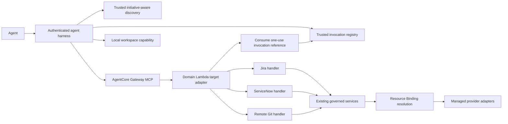

# AgentCore enterprise Gateway configuration

Status: AIDLC-36 application catalog, runtime adapter, and CloudFormation configuration implemented. Deployment requires existing authenticated agent runtime and target Lambda deployments.

## Boundary

The `GatewayCatalog` composes the three existing MCP-facing handler catalogs. It registers 6 Jira, 5 ServiceNow, and 9 remote Git operations. It excludes all delete operations, local Git/build/test operations, and arbitrary provider calls. Names and input schemas come from the strict handler request models. A deterministic hash identifies catalog changes. The CloudFormation synthesis projects those schemas to AgentCore's smaller `SchemaDefinition` shape; required fields and property types derive from the handlers, while the existing Pydantic models retain full validation (patterns, limits, enums, and extra-field rejection). Regenerate `infrastructure/agentcore/gateway.json` with `PYTHONPATH=src .venv/bin/python infrastructure/agentcore/generate.py`.

Gateway target names prefix tool calls (`Jira___jira_get_issue`, for example). The thin `GatewayLambdaTarget` requires AgentCore message version `1.0`, checks the target prefix and registered name, consumes a one-use invocation reference, and passes only business arguments to `GatewayRouter`. The router translates centrally to `TrustedJiraContext`, `TrustedServiceNowContext`, or `TrustedGitContext` and invokes the existing handler. It has no provider client, credential lookup, Resource Binding lookup, or business-policy implementation. Unknown names fail closed.

## Trusted invocation correlation

The authenticated runtime resolves principal, selected initiative, membership, narrowed scopes, approval, task/workspace, and approved commit handoffs before issuing a tool call. `GatewayRuntimeAccess` generates a fresh MCP JSON-RPC message ID and a cryptographically random 256-bit `aidlcInvocationRef`. `TrustedInvocationRegistry` stores only the reference's SHA-256 hash as a key, with a 60-second default expiry, in the shared invocation table. The record binds the authenticated selection, authorized logical scopes and permissions, initiative revision, exact tool name, canonical arguments digest, Gateway ID, target ID, and MCP message ID. The runtime injects the opaque reference into the Gateway target arguments after model argument construction. The model-facing harness catalog remains the original strict business schema, without this field; the Gateway target schema adds it as a required transport field. Only the runtime role may call the IAM-protected Gateway. A raw Gateway `tools/list` response must not be presented to the model.

The target reads the reference from the event, checks AWS-injected Gateway/target/tool/message metadata, and atomically deletes the record through `DynamoDbInvocationRecordStore` before use. It rejects missing, expired, replayed, or mismatched references. It then re-resolves the principal and initiative through the existing Initiative Registry and authorization services, with the issued logical scopes as a restriction. A changed initiative revision or broadened permission set fails. Only the resolved context is passed to the governed handler. The shared runtime IAM role, Gateway ID, target ID, request ID, and model arguments are never treated as end-user identity or authorization. A stolen reference and matching message ID would be a bearer capability until first use or expiry, so both stay inside trusted runtime transport; neither is logged or included in model context.

`InMemoryInvocationRecordStore` supports deterministic tests. Production runtime and target Lambdas must share the CloudFormation invocation table and use the DynamoDB adapter with their respective write/delete IAM policies. The runtime transport must send the generated `message_id` as the MCP JSON-RPC message ID; the target compares it with AgentCore's `bedrockAgentCoreMcpMessageId`. A transport that cannot preserve that ID must fail integration validation rather than bypass the check. The target receives no independent user identity from AgentCore's shared IAM role.

## Discovery and authorization

`GatewayContextResolver` starts with an authenticated principal and selected initiative supplied by the trusted runtime session. It reads the existing Initiative Registry and membership/role policy, constructs the narrowed `ResolvedAuthorizationContext`, then forms `TrustedResolutionContext`. Agent tool arguments cannot set principal, initiative, environment, permissions, scopes, revision, approval, or approved commit handoffs.

`GatewayDiscovery.available_tools(context)` is read-only and deterministic. It requires the base read/write permission, enabled integration, at least one authorized logical scope, and at least one non-deny exact operation policy. An operation with only deny rules is hidden. Git writes additionally require a `READ_WRITE` repository. Profile-disabled writes are hidden. Approval-required operations remain visible with `approvalRequired=true`; discovery never grants approval. Branch patterns are not evaluated against a guessed branch during discovery: a `feature/*` rule may advertise create-branch even when the repository default is `main`. Exact project, record, repository, branch, policy ambiguity, and approval checks still run on every invocation in the existing application service.

AgentCore Lambda targets publish a **static superset** of the approved enterprise operation names. AgentCore's Lambda target discovery does not receive AI-DLC's selected Initiative authorization context. `GatewayRuntimeAccess` is the harness facade: it exposes only `GatewayDiscovery` results, rejects hidden names, and sends eligible invocations through an injected Gateway transport using runtime-held credentials. The authenticated harness must be the only IAM principal allowed to invoke this Gateway. The model must not receive raw Gateway credentials or raw `tools/list` output. Direct calls to a hidden registered name still reach the governed service and are denied there. This distinction is material: static Gateway registration alone is not per-user discovery authorization.

## CloudFormation and IAM

The checked-in AWS-native CloudFormation template creates:

- An `AWS_IAM` AgentCore MCP Gateway and three Lambda targets for the approved domains.
- A Gateway execution role that may invoke only the three same-account, same-region target Lambda functions. Its trust is restricted to AgentCore in the deploying account and Gateway ARN namespace.
- A scoped `bedrock-agentcore:InvokeGateway` policy attached to the supplied existing runtime/harness role name.
- A short-lived DynamoDB invocation table with TTL and encryption at rest. The runtime role has `PutItem`; each target role has `DeleteItem` for atomic one-use consumption.
- Safe outputs: Gateway ARN/ID, target IDs, environment, catalog version, and invocation table name. The runtime uses these IDs when binding invocation references.

There is no second IaC framework in this repository. CloudFormation parameters supply the environment, existing runtime role name, and deployed Jira/ServiceNow/remote Git target function names and role names. Function ARNs are constructed with `AWS::Partition`, `AWS::Region`, and `AWS::AccountId`; cross-account or cross-region targets are not supported. These are trusted deployment identifiers, not provider endpoints or secrets. No physical Initiative Resource Bindings, Jira projects, ServiceNow instances, repository coordinates, passwords, or tokens are in the Gateway template. The target Lambdas require provider-port composition, the shared invocation registry adapter, approved egress, and log delivery. The template does not provision them or create live Jira/ServiceNow/Git HTTP clients. Deployment should restrict Gateway IAM access to the runtime role and validate that no other principal can invoke the Gateway.

AgentCore Gateway itself is managed. `JsonGatewayTelemetrySink` emits only correlation ID, principal/initiative, action, tool name, outcome, and latency to the trusted runtime logger. Existing governed services retain their operation audit. Deployments should deliver Gateway/target logs and CloudTrail data events to approved stores and set retention/metrics there. Tool arguments, issue descriptions, journal bodies, PR text, diffs, provider credentials, and Resource Binding details are excluded from Gateway telemetry. Existing AWS topology requires controlled outbound access; this stack does not assume public provider egress or claim VPC isolation.

## Local workspace and follow-up

AIDLC-35 `workspace.local` remains a separate harness/local runtime capability with task isolation and sandbox requirements. It is absent from the enterprise Gateway catalog and CloudFormation targets.

This ticket provides declarative Gateway registration and the application/runtime transport contracts, including concrete one-use DynamoDB correlation. A live deployment still needs a packaged AgentCore runtime/harness, deployed target Lambdas wired to the shared table and existing authorization services, production provider adapters/managed connection resolution, egress configuration, and observability delivery. Those components are deployment prerequisites because this repository currently has no executable AgentCore runtime or live provider transport. AIDLC-37 owns broader cross-integration contract and failure testing.

AWS references: [Gateway CloudFormation resource](https://docs.aws.amazon.com/AWSCloudFormation/latest/TemplateReference/aws-resource-bedrockagentcore-gateway.html), [Gateway target CloudFormation resource](https://docs.aws.amazon.com/AWSCloudFormation/latest/TemplateReference/aws-resource-bedrockagentcore-gatewaytarget.html), [Lambda target event format](https://docs.aws.amazon.com/bedrock-agentcore/latest/devguide/gateway-add-target-lambda.html), [IAM inbound authorization](https://docs.aws.amazon.com/bedrock-agentcore/latest/devguide/gateway-inbound-auth.html).
