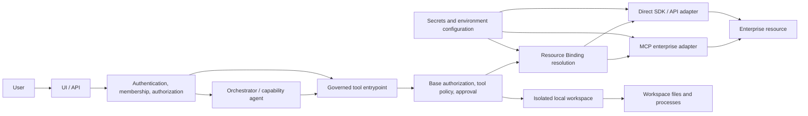

# Enterprise tool contract

Status: Contract defined (AIDLC-31); runtime integration deferred

## Purpose and existing boundaries

Agents request **logical operations**. The trusted tool layer authorizes an
operation for the authenticated principal and selected initiative, then resolves
its logical resource in the active environment. A capability agent never chooses
a connection, endpoint, credential, database, table, bucket, or unrestricted
repository. Another initiative can use the same capability code by registering
its own Profile, permissions, operation policies, and environment bindings.

This contract composes the existing `Principal`, `InitiativeProfile`,
`ResolvedAuthorizationContext`/`LogicalScopes`, `ToolPolicyRequest`, typed
`JiraOperation`/`GitOperation`/`ServiceNowOperation`, and approval gate. It does
not replace their authorization rules. The Resource Binding Registry in
AIDLC-100 implements the logical-to-physical lookup described here.



The lower binding/adapter tier may know physical locations and credentials;
the agent and its prompt do not. Local execution uses a trusted workspace
locator rather than an enterprise connection binding.

## Canonical request and trusted context

The two inputs have different trust levels and must be separate in the API and
in any MCP gateway. The public agent request must use a closed schema that
rejects unknown top-level and operation payload fields. An agent-supplied value
cannot be promoted into trusted context by matching a field name.

| Field | Agent request | Trusted platform context |
| --- | --- | --- |
| `tool_id`, typed `operation` | Select from registered capabilities; server checks the pair | Registry fixes operation risk and required permission |
| `logical_resource_id` | Select a logical target visible in the selected initiative | Must match resolved allowed scope and exact policy target |
| `business_arguments` | Operation-specific fields, identifiers, content, pagination | Validated and bounded by operation schema |
| `principal` | Never | Authenticated `Principal` from AIDLC-26 |
| `initiative_id`, Profile revision | Never as authority | Selected initiative and current/pinned Registry revision |
| `workspace_id`, `task_id` | Never as authority | Server-verified ownership and initiative association, when relevant |
| `allowed_scopes`, permission, policy/approval decisions | Never | Recomputed by AIDLC-27/28/29 at execution boundary |
| `environment`, binding | Never | Deployment context and Resource Binding Registry |
| `correlation_id`, trace/audit lineage | Never as authority | Trusted entrypoint; propagated to adapters |
| `deadline`, cancellation | May request a shorter deadline | Server caps deadline and propagates cancellation |

The operation key and logical resource ID are *requests*, not grants. A model
cannot supply `is_admin`, role, arbitrary project scopes, another initiative
ID, physical endpoint, secret alias, credential ID, or unrestricted repository.
Such fields are rejected, not ignored. Business content may include user text
but may not control routing or authorization. The entrypoint also validates
workspace/task association and any issue, record, branch, or repository target
against the resolved scope before calling a provider.

Conceptual invocation:

```text
agent request:
  tool_id: jira
  operation: read_issue
  logical_resource_id: approved Jira project key
  business_arguments: {issue_id: selected issue}

trusted invocation context (injected after authentication):
  principal; initiative_id; profile_revision; workspace_id; task_id
  allowed logical scopes; policy/approval lineage; environment
  correlation_id; deadline; cancellation signal
```

The tool entrypoint must resolve the selected logical target to an
environment-specific binding only after base authorization, exact tool-policy
evaluation, and any required human approval. An approval is bound to the same
principal, initiative, operation, target, and revision; a stale approval cannot
authorize a later or different call. Missing/ambiguous bindings fail closed.
Adapters receive only the minimum resolved connection and credentials needed
for execution. Bindings and secrets are never serialized back into agent
arguments, prompts, or normal results.

| Logical request target | Trusted environment binding may resolve to |
| --- | --- |
| Jira project scope | Approved Jira connection/site plus project routing |
| ServiceNow scope | Approved instance connection and record-type restrictions |
| Repository ID | Git provider connection and provider repository coordinates |
| Knowledge source ID | pgvector connection, table/namespace, and mandatory filters |
| Artifact store ID | S3 bucket/prefix and access policy |

The binding registry owns these mappings per environment. A Profile can name
approved logical resources, but cannot carry physical connection strings,
secret references, or credentials. The trusted adapter obtains secrets from
infrastructure configuration. A binding must never broaden the Profile and
authorization intersection.

## Result, error, and audit envelope

All adapters return the same versioned envelope to the tool entrypoint. The
agent-visible projection contains a normalized operation result or safe error,
never an unfiltered provider response. Operation payloads have their own
versioned schema and preserve stable logical IDs, status, timestamps, and
permitted content; paging uses an opaque bounded cursor. Unknown provider
fields are discarded. Provider IDs needed for subsequent calls may appear
only as scoped, non-secret record identifiers.

| Field | Meaning |
| --- | --- |
| `contract_version` | Envelope schema version, initially `1` |
| `tool_id`, `operation`, `logical_resource_id` | Executed logical operation and target |
| `outcome` | `success` or `error` |
| `data` | Typed normalized payload on success; absent on error |
| `error` | `{code, message, retryable}` on failure; absent on success |
| `correlation_id` | Stable trace reference for support and audit |
| `audit_ref` | Opaque reference to server-side decision/execution audit |

Exactly one of `data` and `error` is present. The public `message` is safe for
an agent to show; it contains no connection details, credentials, raw HTTP
body, stack trace, or provider token. Normalized error codes are:

| Code | Meaning | Retryable |
| --- | --- | --- |
| `PERMISSION_DENIED` | Base permission, operation policy, or approval gate denies | No |
| `INVALID_SCOPE` | Target is outside allowed logical scope or mismatches selected context | No |
| `INVALID_ARGUMENT` | Public operation arguments fail closed-schema validation | No |
| `RESOURCE_NOT_FOUND` | Authorized target/record is absent | No |
| `UPSTREAM_AUTH_CONFIGURATION` | Trusted binding, credential, or upstream authentication is invalid/unavailable | No; operator action |
| `UPSTREAM_TIMEOUT` | Deadline expired before valid response | Yes, subject to idempotency policy |
| `MALFORMED_UPSTREAM_RESPONSE` | Provider data cannot satisfy normalized schema | No; operator action |
| `TRANSIENT_UPSTREAM_FAILURE` | Temporary provider/network/rate-limit failure | Yes, with bounded backoff |
| `CANCELLED` | Trusted cancellation signal stopped the call | No |

Binding absence or ambiguity maps to `UPSTREAM_AUTH_CONFIGURATION`, with a
safe public message. Invalid agent arguments are rejected before execution;
they are not silently converted into provider calls. A cancellation stops
work where possible and returns a safe cancellation outcome; it is never
treated as success. The entrypoint owns server deadlines and bounded retries.
Writes require a stable idempotency key or explicit reconciliation before
retry after timeout, because the upstream action may already have succeeded.

The operational log may retain sanitized provider status/code, adapter name,
binding ID, decision IDs, timing, attempt count, and correlation ID. It must
redact secrets, raw authorization headers, and sensitive payloads. The LLM
sees only the safe envelope. Audit failure prevents an allow result, consistent
with AIDLC-27/28. Authorization decision IDs and approval lineage remain in
server audit; `audit_ref` need not expose those internals to the model.

## Jira contracts

`tool_id=jira` uses `JiraOperation` and a `JiraProjectTarget` whose project key
comes from the selected Initiative Profile and narrowed `allowed_scopes`.
The agent may choose an allowed key but cannot add a project by prompt. Every
issue ID is checked against the authorized project before read or write; search
is forcibly constrained to approved projects, regardless of query text.

| Operation | Business arguments | Normalized result | Gate |
| --- | --- | --- | --- |
| `READ_ISSUE` | Issue ID, requested supported fields | Issue ID/key, type, summary, status, allowed fields, links | `jira.read` + exact read policy |
| `SEARCH` | Typed filters, bounded page size/cursor | Page of normalized issue summaries | `jira.read` + exact search policy |
| `CREATE_ISSUE` | Type, summary, permitted fields | Created issue ID/key and status | `jira.write` + exact create policy/approval |
| `UPDATE_ISSUE` | Issue ID, permitted field patch, version when available | Updated issue ID/key and status | `jira.write` + exact update policy/approval |
| `TRANSITION_ISSUE` | Issue ID, approved transition ID, optional fields | Issue ID/key and new status | `jira.write` + exact transition policy/approval |
| `ADD_COMMENT` | Issue ID, comment body | Comment ID, issue ID/key, timestamp | `jira.write` + exact comment policy/approval |

Jira project keys are logical authorized scopes in the current Profile; Jira
site, connection, auth, and credentials belong to environment bindings. The
adapter translates Jira-specific fields and errors. `DELETE_ISSUE` exists in
the policy enum but is outside this initial tool surface and stays denied
unless explicitly added with its own policy and contract in a later story.

## ServiceNow contracts

`tool_id=servicenow` uses `ServiceNowOperation` and the existing
`ServiceNowTarget.scope_id`. The selected Profile's enabled scopes and exact
tool rules constrain access; base authorization checks the read/write grant.
The [AIDLC-33 ServiceNow contract](servicenow-mcp-integration.md) enforces
incident/request record types, logical scope, assignment-group restrictions,
and a bounded write-field surface. Arbitrary table names and encoded provider
queries are not public business arguments.

| Operation | Business arguments | Normalized result | Gate |
| --- | --- | --- | --- |
| `READ_RECORD` | Scoped record ID and type (`incident` or `request`) | ID, number, type, state, permitted fields | `servicenow.read` + exact read policy |
| `SEARCH` | Typed filters, bounded page size/cursor | Page of scoped record summaries | `servicenow.read` + exact search policy |
| `CREATE_RECORD` | Approved type and permitted fields | Created ID, number, state | `servicenow.write` + exact create policy/approval |
| `UPDATE_RECORD` | Scoped ID/type, permitted field patch | Updated ID, number, state | `servicenow.write` + exact update policy/approval |
| `ADD_COMMENT` | Scoped ID/type, text and approved channel (comment/work note) | Entry ID, record ID, timestamp | `servicenow.write` + exact comment policy/approval |

The initial scope-to-record-type mapping accepts `incident` and `request` only;
assignment-group checks use the selected Profile. Instance URL,
connection, and authentication stay below the adapter. `DELETE_RECORD` is
not part of the initial surface despite its policy enum entry.

## Git domains

The existing `GitOperation` enum is a **permission/policy taxonomy**, not one
transport or one generic `git_tool`. The execution contract has two separate
registered tool domains and adapters:

| Domain | Examples | Boundary |
| --- | --- | --- |
| Remote Git provider | Repository/branch metadata, remote diff, PR metadata, create branch, push/update branch, create/update PR | `git.remote` provider adapter, possibly governed MCP; resolves logical repository ID to provider connection and repo coordinates |
| Local workspace | Checkout, status, local diff, apply patch, file inspection/edit, build, test, local commit | `workspace.local` isolated execution with a server-selected workspace root; never a remote provider call |

`READ_REPOSITORY`, `READ_BRANCH`, `READ_DIFF`, `CREATE_BRANCH`, `PUSH`,
`CREATE_PR`, and `UPDATE_PR` describe remote permissions when invoked through
`git.remote`. `COMMIT` describes a local workspace action and cannot be
dispatched to a Git provider merely because it appears in `GitOperation`.
The AIDLC-34 remote integration adds `READ_PR` and `LIST_BRANCHES` with explicit
`git.read` policy; see the [Git provider contract](git-provider-integration.md).
Local status/diff/build/test use the [AIDLC-35 local workspace toolset](local-workspace-toolset.md)
with task isolation and workspace containment. A local diff and remote diff have
different tool IDs and result provenance. Remote writes require the selected
logical repository, branch policy, `git.write`, exact operation policy, and
approval when required. The provider adapter owns GitHub/Bitbucket/GitLab
request translation; capability agents use the same logical contract.

## Implementation ownership

This document defines the common boundary. AIDLC-32 implements the
[governed Jira application and MCP-facing contract](jira-mcp-integration.md).
AIDLC-33 implements the [governed ServiceNow contract](servicenow-mcp-integration.md);
AIDLC-34 implements [remote Git provider operations](git-provider-integration.md);
AIDLC-35 implements [isolated local workspace tools](local-workspace-toolset.md);
AIDLC-36 defines the [AgentCore Gateway catalog and CloudFormation configuration](agentcore-gateway.md).
AIDLC-100 supplies the
Resource Binding Registry contract and in-memory resolver; durable storage and
managed connection lookup remain deployment work. Future integration stories
should test schema rejection, scope immutability, normalization, and redaction.
