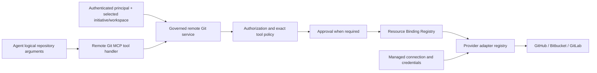

# Governed remote Git provider integration

Status: Application and transport-neutral MCP-facing contract implemented (AIDLC-34)

## Boundary and request path

`GitRemoteMcpToolHandler` is a transport-neutral catalog for **remote provider**
operations. It has no MCP SDK dependency; AIDLC-36 will register it in the
runtime/gateway. The service uses the existing policy, approval, and Resource
Binding Registry, then chooses an injected provider adapter from the binding's
`GitProvider` enum. Provider-specific API translation and managed connection
lookup stay below the port. The current implementation includes an in-memory
provider and registry for offline tests, not a live GitHub/Bitbucket/GitLab
client.

Local checkout, status, diff, patch, file edits, build, test, and commit are
**not** part of this handler. `GitOperation.COMMIT` remains in the existing
policy taxonomy but is unregistered here. AIDLC-35 owns local workspace
execution. `DELETE_BRANCH` is likewise unregistered.

## Public operations and normalized results

| Remote operation | Business arguments | Normalized result |
| --- | --- | --- |
| `READ_REPOSITORY` | Logical repository ID | Display name, default branch, archived state |
| `READ_BRANCH` | Repository ID, branch | Branch, head SHA, protected flag |
| `LIST_BRANCHES` | Repository ID, bounded page size/cursor | Branch page and opaque cursor |
| `READ_DIFF` | Repository ID, base/head refs | Bounded changed files, counts, explicit truncation |
| `READ_PR` | Repository ID, PR number | PR number, title, state, base/head, author display |
| `CREATE_BRANCH` | Repository ID, new/source branches | Created branch |
| `PUSH` | Repository ID, branch, approved commit SHA, expected head SHA | Updated branch |
| `CREATE_PR` | Repository ID, base/head branches, title/description | Created PR |
| `UPDATE_PR` | Repository ID, PR number/head, permitted title/description patch | Updated PR |

`LIST_BRANCHES` and `READ_PR` extend the existing Git policy taxonomy with
explicit `git.read` risk. `PUSH` names the existing write operation, but its
contract is a **remote provider branch update**, never a local `git push`
process. The requested commit SHA must be present in trusted context as a
`(logical repository ID, SHA)` handoff from a verified workflow. An agent's
SHA alone is insufficient. The provider must apply `expected_head_sha` as an
atomic conditional update and reject stale/non-fast-forward changes. The
in-memory adapter models the stale-head conflict; production adapters must
also enforce provider branch protection and fast-forward semantics.

All requests reject unknown fields. They contain no provider choice, owner,
physical repository name, connection alias, remote URL, credential, environment,
or initiative authority claim. The version-1 `git.remote` envelope contains
only normalized repository, branch, diff, or PR models, safe error codes,
correlation ID, and audit reference. Raw provider JSON and authentication data
are never projected to the agent.

## Scope and execution gates

The selected Initiative Profile's repository IDs intersect with the resolved
authorization scope. The service rejects an out-of-scope logical ID before
policy, binding, or provider execution. Reads require `git.read`; writes
require `git.write`, Profile `READ_WRITE` repository access, enabled Git write
policy, an exact operation rule, and approval when required. Existing branch
patterns in tool policy apply to write targets. There is no invented global
protected-branch rule; a deployment must configure exact branch policies and
the provider adapter must honor upstream branch protections.

After approval, `ResourceBindingRegistry.resolve` uses
`ResourceType.GIT_REPOSITORY` and the logical Profile repository ID. It checks
the provider type against the Profile. Its binding contains managed connection
alias and trusted owner/repository coordinates for the adapter only. Adding a
new initiative requires Profile, authorization/policy, binding, and provider
setup, not changes to capability-agent source.

Provider responses are revalidated against requested logical repository,
branch/PR number, base/head refs, page bounds, and default branch. PR update
first reads the target PR and checks its head before mutation. A production
adapter must also enforce this condition atomically to avoid races. Mismatched
or malformed responses fail closed.

## Diff, errors, and audit

Remote diff results allow at most 100 file entries, 4096 UTF-8 bytes per patch,
and 32768 patch bytes total. `changed_file_count`,
`omitted_file_count`, `patches_truncated`, and `truncated` make omission explicit.
An adapter must normalize and bound provider data before returning it; an
oversize or inconsistent adapter result fails as `MALFORMED_UPSTREAM_RESPONSE`.
This handler never runs local `git diff`.

Provider failures use the common AIDLC-31 error taxonomy. Branch-exists,
stale-head, and similar provider conflicts deliberately map to
`INVALID_ARGUMENT` with a safe generic message until a shared conflict code
is introduced. Provider exception text is suppressed. Timeouts are bounded;
there are no automatic retries. Read timeout/transient results may be retried
by a future bounded caller. Writes are marked non-retryable after unknown
failure because they may already have succeeded.

Audit events record principal, initiative, workspace/task, logical repository,
operation, branch or PR number, outcome, timing, correlation, and policy
decision ID. They omit connection aliases, credentials, PR descriptions,
diff patches, and raw provider bodies. Audit failure prevents a success result.

## Shared governance and deferred work

Jira, ServiceNow, and remote Git now repeat parts of the policy → approval →
binding → provider → normalized result/audit sequence. Their project, record,
and repository scope semantics differ. A later Shared Agent Harness / SDK
story can extract only the stable common execution steps; this story does not
refactor unrelated integrations.

AIDLC-35 provides [local workspace Git and trusted commit production](local-workspace-toolset.md).
AIDLC-36 owns MCP SDK/AgentCore Gateway registration and live managed connections.
AIDLC-37 owns broader provider contract tests and live adapter verification.
