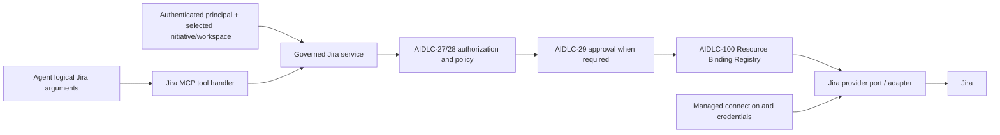

# Governed Jira MCP integration

Status: Application and transport-neutral MCP-facing contract implemented (AIDLC-32)

## Request path

`JiraMcpToolHandler` is a thin operation catalog and JSON projection. It has
no MCP SDK dependency; AIDLC-36 will register it in the runtime/gateway. The
same `GovernedJiraService` can be called by tests or trusted internal code.
The provider port owns Jira-specific transport and conversion into normalized
models. This repository currently has an in-memory provider for local and
contract tests, with no live Jira connection or HTTP client.

## Public request and result contract

The six registered operations reuse `JiraOperation`: `READ_ISSUE`, `SEARCH`,
`CREATE_ISSUE`, `UPDATE_ISSUE`, `TRANSITION_ISSUE`, and `ADD_COMMENT`.
`DELETE_ISSUE` is deliberately not registered. Each operation has a strict
Pydantic request model with `extra=forbid`. The public fields are a logical
project key, issue key where relevant, typed search filters, and bounded
business content. Search has one project per call, a bounded page size, and an
opaque cursor. It accepts no JQL. A text filter remains literal business text;
an adapter must escape it when translating to a provider query.

The response uses the AIDLC-31 version-1 envelope with normalized issue
detail, issue summary, search page, write result, or comment result. Search
pagination exposes `has_more` and an opaque `next_cursor`. Provider custom
fields, raw JSON, status bodies, and connection details are excluded. Errors
use the documented stable codes and safe messages; provider exception text is
never copied to the agent. The service revalidates provider results and
rejects mismatched project/issue identity or malformed pages.

## Trusted scope and execution gates

`TrustedJiraContext` is injected separately from MCP arguments. It contains
the AIDLC-100 `TrustedResolutionContext`, selected Profile revision, optional
server-verified workspace/task IDs, bounded timeout, and trusted approval ID.
The Jira service checks the requested project against both the current
Initiative Profile and narrowed `ResolvedAuthorizationContext.allowed_scopes`.
For issue operations, the issue key's project prefix must match before the
provider is called. Provider output is checked again to prevent a numeric or
misrouted upstream issue from escaping the selected project.

The service calls the existing `ToolPolicyService`, which re-evaluates base
authorization and exact Jira operation policy. It passes a restriction derived
from the trusted allowed projects, so policy evaluation cannot broaden the
snapshot. Reads require `jira.read`; writes require `jira.write`, an enabled
Profile write policy, and an exact operation rule. When policy requires human
approval, the service calls the existing `ApprovalService` to recheck the
approved principal, initiative, operation, project target, and revision.
Denial stops before binding or provider invocation.

Only after the gates pass does the service resolve `ResourceType.JIRA` with
logical resource ID `jira` and the approved project through the existing
Resource Binding Registry. The resulting `JiraBinding` contains managed
connection/site aliases for the trusted provider. Project keys are absent
from the binding; binding existence never authorizes a project. An agent
cannot provide environment, initiative, role, allowed-project list, URL,
connection alias, token, or secret reference through any request schema.

The production provider adapter will resolve managed aliases to its endpoint
and credentials below this boundary. The application layer has no environment
variable lookup, Jira SDK, `requests`, or MCP SDK dependency. A user with
multiple initiative memberships gets different Jira scopes by selecting a
trusted initiative context; no user-to-project table lives in Jira code.

## Failure, timeout, and audit behavior

The tool envelope distinguishes scope, permission, argument, not-found,
upstream configuration/authentication, timeout, malformed response, transient,
and cancellation errors. The provider port uses typed sanitized failures.
Unknown provider exception text is suppressed. Calls use a server-bounded
timeout supplied to the provider. The application service does no automatic
retry. Read timeout/transient responses may be retried by a future bounded
caller; write responses mark those failures non-retryable because the upstream
write may already have happened. AIDLC-36 must provide deadline propagation
and an actual network adapter before live use.

Each invocation emits an audit event with correlation/audit ID, principal,
initiative, workspace/task, operation, logical project, outcome, latency, and
policy decision ID. It excludes binding aliases, credentials, issue/comment
bodies, and raw provider errors. An audit sink failure prevents a successful
agent-facing result. Durable execution audit and provider diagnostics are
later infrastructure work.

## Deferred work

AIDLC-36 owns MCP SDK/AgentCore Gateway registration and live connection
management. AIDLC-37 owns a broader provider contract suite against a real
Jira adapter. This story adds no ServiceNow, remote Git, or local execution
behavior.
