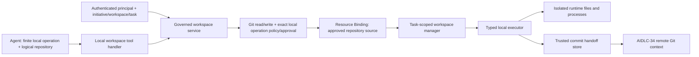

# Governed local code workspace toolset

Status: Application contract and local test/development adapter implemented (AIDLC-35)

## Boundary

`workspace.local` is a finite, transport-neutral local capability catalog. It
is not an enterprise MCP server and never performs provider API calls, remote
pushes, or PR operations. AIDLC-34 owns remote Git. AIDLC-36 may wire this
handler into a runtime but is not needed for its application contract.

## Task isolation and lifecycle

The trusted context supplies selected initiative, principal, workspace ID,
task ID, Profile/revision, environment, correlation, deadline, and optional
approval. An agent supplies only logical repository ID plus operation-specific
business arguments. `WorkspaceKey` is `(initiative_id, workspace_id, task_id,
repository_id)`; the manager also checks the principal owner. A trusted
temporary-directory manager chooses an unpredictable root and a separate
temporary HOME. No host path or workspace key authority is in public schemas.

`PREPARE` is idempotent while active. It resolves the existing Git Resource
Binding after authorization and obtains code from a managed local mirror
selected by trusted provider/owner/repository coordinates. The test/local
adapter runs `git clone` from that mirror; it accepts no agent URL and no
provider credentials. Production materialization may use a managed cache or
isolated provider fetch below the same port. Every later operation rechecks
initiative repository scope, permission, exact policy/approval, active binding,
and task ownership. Cleanup is the exception to binding re-resolution so a
revoked binding cannot strand local files.

States are `ACTIVE`, `CLEANING`, `CLEANED`, and `FAILED`. Explicit cleanup
removes only the temporary container created by the manager. Repeated cleanup
returns `CLEANED`. A failed deletion records `FAILED` and may be retried by
cleanup; ordinary operations reject non-active states. The task orchestrator
should invoke the trusted manager cleanup at terminal task completion, including
for read-only tasks whose agent cannot call the write-gated cleanup tool. Production should add a
retention/expiry sweeper for abandoned or diagnostic workspaces; no automatic
TTL is claimed by this adapter.

## Operations and policy

| Local operation | Permission/policy | Behavior |
| --- | --- | --- |
| Prepare | `git.read`, exact `PREPARE_WORKSPACE` | Materialize approved logical repository |
| Status, diff | `git.read`, exact `LOCAL_STATUS`/`LOCAL_DIFF` | Structured status and bounded local diff |
| Checkout, apply patch | `git.write`, exact `LOCAL_CHECKOUT`/`LOCAL_APPLY_PATCH` | Local ref switch or contained text patch |
| Build, test | `git.write`, exact `LOCAL_BUILD`/`LOCAL_TEST` | Execute only selected Profile commands |
| Commit | `git.write`, existing `GitOperation.COMMIT` | Stage selected paths and create local commit |
| Cleanup | `git.write`, exact `LOCAL_CLEANUP` | Remove owned task workspace |

The local policy operations extend the existing Git **policy taxonomy**; the
remote MCP catalog does not register them. `COMMIT` is consumed only here.
Existing Profile `git_write` enablement, repository `READ_WRITE` access, exact
operation policies, branch patterns, and approval gates apply. A read-only
principal can prepare and inspect but cannot mutate. The service uses the
current Profile intersected with the narrowed authorization repository IDs;
membership or binding existence alone does not grant access.

## Execution controls

There is no public `run_shell` operation. The executor exposes typed methods
for checkout, status, diff, patch, configured build/test, and commit. Git
invocations use fixed argv shapes and `shell=False`. Branch/ref arguments are
validated and passed after `--`. A commit stages only validated selected
paths, resets prior staging, uses a fixed task identity (`AI-DLC` with an
invalid example email domain), disables hooks for its Git command, and never
changes global Git configuration.

`BuildProfile.build_command` and `test_command` are existing trusted Profile
strings. The service rejects shell operators/substitution and parses them to
argv; the runtime-supplied executable map permits only approved executable
names. Agents select a logical build profile ID, not a command. The runner
passes a minimal environment containing only task HOME/XDG paths, approved
executable PATH, locale, and noninteractive Git settings. It does not inherit
host secret variables. Processes have a bounded deadline, are killed as a
process group on timeout, and write stdout/stderr to temporary files before
the result reads at most 8192 bytes from each. Exit status, duration, success,
and truncation flags are returned. Build/test failure can be a successful tool
invocation with `success=false` and a nonzero exit code.

This Python adapter is suitable for local/CI development inside a trusted
runtime. It does **not** enforce filesystem, network, CPU, memory, or disk
isolation against arbitrary code in a checked-out repository. Production must
run it in a container/VM or equivalent isolated task runtime with those
limits, no host secrets, restricted network, and a controlled mirror mount.

## Containment, bounded diffs, and patches

Paths reject absolute names, traversal, control characters, and symlink
components. Canonical paths must remain under the manager-created repository
root. Patch headers must name at most 20 matching relative text paths; binary,
rename/copy, and symlink/submodule modes are rejected. The patch is capped at
65536 UTF-8 bytes, checked with `git apply --check`, then applied from stdin.
Patch text is never included in the normalized result or audit event.

Status parses porcelain output into staged, modified, and untracked paths,
with at most 100 entries per category and an explicit omitted count. Local
diff has `source=local_workspace`, at most 100 changed files, at most 4096
bytes of patch per file, and 32768 patch bytes total. Truncation is explicit.
This is separate from AIDLC-34 `source=remote_provider` diffs.

## Trusted commit handoff and audit

On successful local commit, the executor returns a validated SHA. The service
creates and stores `TrustedCommitHandoff` containing initiative, workspace,
task, logical repository, principal, SHA, and timestamp. The public commit
result can display the SHA but cannot create the handoff. A trusted runtime
composition layer queries the handoff store with those identities and injects
the resulting `(repository_id, commit_sha)` pairs into AIDLC-34
`TrustedGitContext.approved_commits`. The remote service requires that pair
before provider-side branch update. The handoff is never taken from prompt
text or a public request field. The service records the execution audit before
publishing a handoff: an audit failure cannot approve a remote update. A
handoff-store failure leaves the local commit in place but returns a safe
configuration error and no approved pair; callers must reconcile before retry.

Each operation emits an audit event with principal, initiative, workspace/task,
logical repository, operation, branch where relevant, outcome, latency,
correlation, policy decision, and commit SHA where relevant. It omits host
paths, patch text, source content, process output, environment, credentials,
and connection alias. Audit failure prevents an agent-facing success result.

Jira, ServiceNow, and remote Git share an enterprise policy/binding/provider
sequence. Local workspace adds lifecycle, path containment, subprocess, and
cleanup concerns, so it is kept separate from their remote integration code.

AIDLC-36 owns runtime/gateway registration and production sandbox deployment;
AIDLC-37 owns broader integration contract tests. Live enterprise Git source
materialization is not implemented here.
