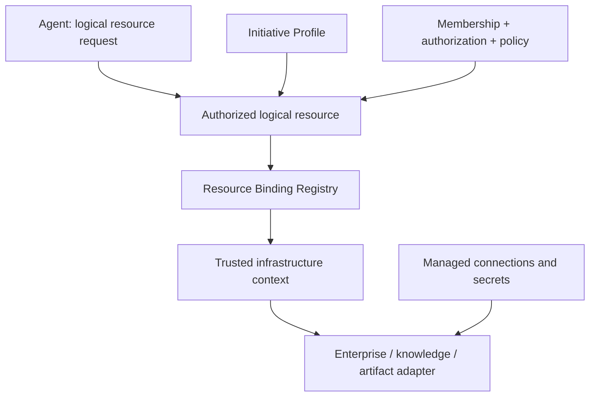

# Identity, Initiative, and Resource Resolution

Status: Resource Binding Registry application contract implemented (AIDLC-100)

## Purpose

AI-DLC must support multiple teams using the same reusable agents while keeping each user's authorized project scope and knowledge sources isolated.

The platform therefore separates three decisions:

1. **Who is the user?**
2. **Which initiatives and logical resources may that user access?**
3. **Where are those logical resources physically hosted in this environment?**

Agents do not answer these questions themselves.

## Implemented Resource Binding Registry

`ResourceBindingRegistry` is a trusted control-plane service with an injected
`ResourceBindingRepository` and mutation-event sink. Its in-memory adapter is
for tests/local use; production persistence and connection/secret lookup are
separate. A binding key is `(environment, initiative_id, resource_type,
logical_resource_id)`. Approved environment names are supplied to the service
by deployment configuration. Jira and ServiceNow use one connection binding
per initiative (`jira` and `servicenow` IDs); Git repositories, knowledge
sources, and artifact stores use their Profile-declared logical IDs.



The agent-facing `LogicalResourceRef` has only resource type, logical ID, and
Jira project or ServiceNow scope target where applicable. Environment,
Initiative Profile, resolved authorization snapshot, and correlation ID are
injected in `TrustedResolutionContext`. Resolution checks the current Profile,
narrowed logical scopes, and the matching read/write grant before loading an
exact binding. Tool-operation policy and human approval still precede this
service at the trusted tool entrypoint; binding existence never grants access.
ServiceNow logical scopes and logical artifact-store IDs now participate in
authorization scope narrowing. Artifact stores are optional logical Profile
declarations; no bucket appears in the Profile.

`register`, `get`, `list`, `update`, and `disable` are control-plane operations.
Updates use an expected revision and increment the binding revision. Disabled,
missing, mismatched, or unauthorized resolution fails closed. Mutation events
record the logical key, revision, timestamp, and correlation ID, without binding
details. `ResolvedResource` is for trusted adapters only and must never be
serialized to an agent result. The agent-visible result contract remains the
normalized envelope in [AIDLC-31](enterprise-tool-contract.md).

| Binding type | Trusted metadata | Scope source |
| --- | --- | --- |
| Jira | Managed connection and site aliases | Profile Jira projects intersected with authorized projects |
| ServiceNow | Managed connection and instance aliases | Enabled Profile scopes intersected with authorized scopes |
| Remote Git repository | Provider, managed connection alias, repository coordinates | Profile repository IDs intersected with authorized IDs |
| Knowledge/pgvector | Managed connection alias, table, optional namespace, immutable mandatory filters | Enabled Profile knowledge source IDs intersected with authorized IDs |
| Artifact/S3 | Managed bucket alias and required relative prefix | Profile artifact-store IDs intersected with authorized IDs |

Jira connection selection does not contain or authorize project keys. The
Profile and authorization layer determine projects. Safe aliases point to
approved infrastructure configuration; this registry stores no URL, secret ARN,
token, password, or connection string. Actual endpoint/credential resolution is
an adapter or runtime responsibility below this boundary.

### Knowledge isolation

The binding explicitly declares `DEDICATED_INSTANCE`, `SEPARATE_LOCATION`, or
`FILTERED_SHARED_LOCATION`. The in-memory repository rejects cross-initiative
reuse of a dedicated connection, a colliding separate table/namespace, or a
shared table/namespace without filtered isolation. A filtered shared location
requires an immutable `initiative_id = <binding initiative>` metadata filter;
other mandatory filters are carried with it. The future knowledge adapter must
combine these filters with user query filters using `AND` and must never let
query arguments replace them. Sharing a pgvector instance or table does not
permit another initiative's logical source to resolve. Artifact bindings also
reject overlapping prefixes for different initiatives in the same environment
and bucket alias.

Repository ports must preserve these invariants atomically when replaced by
durable storage. The current event sink follows the Initiative Registry's
post-mutation audit pattern; production persistence should commit binding
state and audit atomically. No provider network calls or secrets store is part
of AIDLC-100.

## Resolution chain

```text
Authenticated user (Okta / enterprise IdP)
        ↓
Principal
        ↓
Initiative memberships
        ↓
Selected initiative / workspace
        ↓
Initiative Profile logical scopes
        ↓
Authorization-policy intersection
        ↓
Resolved Resource Context
        ↓
Tool / Knowledge adapters
        ↓
Physical Jira / Git / pgvector / S3 resources
```

### Example

A user may belong to:

- POS initiative
- AI Center of Excellence initiative

The user should not be hardcoded to `NEWPOS` or `AICOE` in agent code.

Instead:

- Membership says the user may enter POS and AICOE.
- POS Initiative Profile declares its allowed Jira projects and logical knowledge sources.
- AICOE Initiative Profile declares its own scopes.
- Authorization intersects membership/tool permissions with the selected initiative.
- Resource bindings resolve the selected initiative's logical resources to environment-specific Jira connections and pgvector locations.

## Jira resolution

Initiative configuration owns allowed Jira project scopes.

Example logical configuration:

```yaml
integrations:
  jira:
    enabled: true
    projects: [NEWPOS, DCTZ]
```

This does not contain Jira credentials.

An environment binding selects the approved Jira connection/site.

At runtime the trusted tool layer receives logical context such as:

```text
initiative_id = pos
allowed_projects = [NEWPOS, DCTZ]
principal = user-123
permissions = [jira.read]
```

The environment-specific connection alias is selected by Resource Binding
resolution after authorization. It is not an agent argument or prompt value.

If a user belongs to multiple initiatives, the selected workspace determines which initiative scopes are active. Membership or policy may further narrow those scopes.

## Knowledge / pgvector resolution

Initiative Profiles own logical Knowledge Source IDs, not physical pgvector topology.

Example:

```text
pos-code
central-code
functional-concepts
design-documents
release-notes
```

A Resource Binding Registry maps each logical source to a retrieval binding.

A binding may include non-secret routing metadata such as:

- connection alias
- database/schema alias
- table or collection identifier
- logical namespace
- source type
- mandatory metadata filters
- embedding/index profile
- environment

Credentials and endpoints are resolved through infrastructure/secrets configuration rather than Initiative Profiles or agent prompts.

Examples of valid physical strategies:

### Current-style multi-table deployment

```text
POS initiative
  pos-code             → shared-rag / code table A
  central-code         → shared-rag / code table B
  functional-concepts  → shared-rag / docs table A
  design-documents     → shared-rag / docs table B
  release-notes        → shared-rag / docs table C
```

### Two company-wide pgvector services

```text
Company Code pgvector
  ├── POS code
  ├── Team B code
  └── Team C code

Company Documents pgvector
  ├── POS design docs
  ├── POS functional docs
  ├── Team B docs
  └── Team C docs
```

The same agent request remains a logical source selection:

```text
retrieve(source_ids=["pos-code", "design-documents"], query="...")
```

The selected initiative ID is injected by the trusted platform. Only resource
bindings change when physical topology changes.

## Isolation requirements

Every retrieval request must carry resolved initiative/user context.

The retrieval layer must enforce:

- initiative scope
- logical source scope
- repository/source restrictions
- user/tool permission
- mandatory metadata filters

The LLM must not be trusted to remember or invent these filters.

Cross-initiative retrieval must be explicitly authorized rather than occurring because two teams share the same HNSW index or PostgreSQL instance.

## Ownership

### Identity / RBAC layer
Owns:
- authenticated principal
- initiative membership
- role/capability/tool permissions
- optional user-level narrowing of project/tool scopes

### Initiative Profile
Owns:
- logical Jira projects
- repositories
- logical knowledge source IDs
- logical artifact-store IDs
- build profiles
- initiative policy/default declarations

### Resource Binding Registry
Owns:
- mapping logical resources to environment-specific physical resources
- pgvector topology bindings
- Jira connection aliases
- artifact-store aliases
- required retrieval filters

### Knowledge Service
Owns:
- retrieval API
- binding resolution
- pgvector query execution
- provenance and filtering
- hiding physical table/cluster details from agents

### Capability agents
Own:
- domain reasoning and output contracts

They do not own:
- user-to-project mapping
- Jira credentials/site selection
- pgvector instance selection
- table/namespace selection
- database connection logic

## Open infrastructure decision

The enterprise pgvector topology is deliberately unresolved.

Candidates include:

1. team/initiative-specific instances
2. one shared instance with multiple tables/namespaces
3. two company-wide stores: code and documents
4. another hybrid based on scale/security/performance

The platform should support all candidates through bindings. The final choice should be based on measured volume, isolation requirements, operational ownership, query performance, indexing behavior, and cost rather than agent design.
