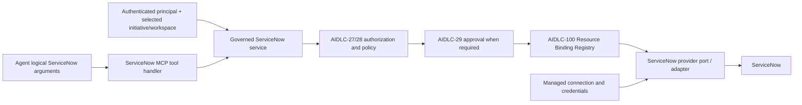

# Governed ServiceNow MCP integration

Status: Application and transport-neutral MCP-facing contract implemented (AIDLC-33)

## Request path

`ServiceNowMcpToolHandler` exports five public input schemas and passes only
business arguments to `GovernedServiceNowService`. AIDLC-36 will register the
handler in an MCP runtime/gateway. The application service depends on the
existing tool policy, approval, and Resource Binding Registry, and an injected
provider port. No live ServiceNow connection or HTTP adapter exists yet; the
in-memory provider makes the contract executable without enterprise access.

## Logical contract

The registered operations are `READ_RECORD`, `SEARCH`, `CREATE_RECORD`,
`UPDATE_RECORD`, and `ADD_COMMENT`. `DELETE_RECORD` remains unregistered.
Each strict request requires a logical `scope_id` and `record_type`; this
initial surface supports only `incident` and `request`, with the scope equal
to the record type. An agent cannot choose a physical table. A future scope
mapping for other logical scopes must be a trusted configuration/policy change.
The provider will translate these types to approved ServiceNow tables below
the port; no table name or encoded query reaches the agent schema.

Search accepts typed number, state, literal text, and assignment-group filters,
plus a page size of 1–100 and an opaque cursor. A production adapter must
escape literal values before constructing any provider query. Writes expose
only short description, description, state, or bounded journal text where
applicable. `ADD_COMMENT` uses an enum for public `comment` and internal
`work_note`; arbitrary journal fields and system/ACL fields are rejected.
The two channels share the `servicenow.write` and exact `ADD_COMMENT` policy
gate in this initial contract. A future policy that restricts one channel
needs a separate trusted channel rule before that channel can be offered.

The version-1 result envelope contains normalized record detail, search page,
write result, or journal result. It includes a correlation ID and audit reference
but no raw ServiceNow JSON, instance URL, connection alias, authentication,
transport body, or provider exception. Errors use the common AIDLC-31 codes.

## Scope, identity, and assignment groups

Trusted context is injected separately from tool arguments. The service
intersects the selected Profile's ServiceNow scopes with the resolved
authorization scopes, then re-evaluates base authorization and exact operation
policy. Reads require `servicenow.read`; writes require `servicenow.write`,
enabled Profile write policy, and approval where requested by existing policy.
The selected trusted initiative determines scopes for a multi-initiative user;
no user-to-scope mapping is embedded in this integration.

Only after these gates pass does the registry resolve
`ResourceType.SERVICENOW`, logical ID `servicenow`, and the authorized scope.
The resulting managed connection and instance aliases are adapter-only.
Endpoint and credential resolution belongs below the provider port.

The Profile's optional assignment-group list is also enforced. Searches may
request only a listed group, and returned records are checked against the list.
Get and preflight reads for update/comment are checked after provider retrieval;
a cross-group record never reaches the agent or a write call. Create fails closed
when assignment groups are configured, because this initial create schema has
no trusted group routing. A later contract may add approved group routing with
an explicit authorization rule. This restriction does not alter the Profile
schema or infer authorization from upstream ACLs.

## Provider and failure behavior

Provider responses are parsed into strict normalized models and rechecked for
requested scope, record type, identity, page size, and assignment group. Update
and journal writes first read and validate the target record. This guards
against a wrong-scope target before mutation; a production provider must also
enforce the constraint atomically or reconcile races at its transport boundary.
Malformed or cross-scope provider data fails closed.

The service sends a bounded timeout to the adapter and does not retry calls.
Read timeouts/transient errors may be retried by a future bounded caller;
write failures are marked non-retryable because upstream success may be unknown.
Sanitized provider errors map to stable codes and messages. Audit events hold
principal, initiative, workspace/task, operation, logical scope/type, outcome,
latency, correlation, and policy decision ID. Comment bodies, descriptions,
connection aliases, credentials, and raw provider payloads are excluded.
Audit failure prevents a successful result from being returned.

## Jira comparison and deferred work

Jira and ServiceNow share the policy → approval → binding → provider → normalized
result sequence. Their current services duplicate some orchestration, error,
and audit code. ServiceNow has a different scope/record model, assignment-group
restriction, and journal channel; the stable common pipeline can be extracted
in a later shared tool harness rather than refactoring Jira during this story.

AIDLC-36 owns MCP SDK/AgentCore Gateway registration, live managed connection
lookup, and deadline propagation. AIDLC-37 owns broader provider contract
tests and production transport verification. Remote Git and local workspace
execution remain separate stories.
